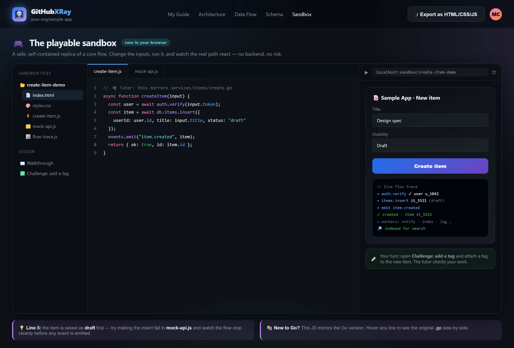

# GitHubXRay

GitHubXRay is an interactive project tutor that helps developers understand unfamiliar Git repositories. It turns repository analysis into a guided learning experience with architecture maps, data-flow walkthroughs, schema explanations, and hands-on sandbox exercises.

## Overview

Understanding an existing codebase often requires reading outdated documentation, tracing requests across many files, and asking experienced teammates for help. GitHubXRay is designed to make that process clearer and more practical.

Users provide a Git repository and answer a short set of questions about their role, experience, and learning goals. The system analyzes the repository and organizes the results into a personalized guide based on the actual project.

## Features

- Guided tours of important application flows
- Architecture views showing how components interact
- Data-flow explanations showing how values change across a request
- Database schema and relationship explanations
- Language and framework concepts explained in context
- A safe sandbox for experimenting with core project flows
- Personalized learning content based on the user's goals
- Exportable learning material without vendor lock-in

## How It Works

1. Connect a public or private Git repository.
2. Provide your role, experience level, goals, and preferred learning depth.
3. Analyze the repository structure, architecture, schema, data flows, and coding patterns.
4. Combine the analysis into a project-specific learning guide.
5. Explore the guide through visual explanations, walkthroughs, and exercises.

## Analysis Pipeline

GitHubXRay uses a set of specialized analysis roles:

| Role | Responsibility |
| --- | --- |
| Explorer | Maps repository structure, entry points, and module boundaries. |
| Architect | Identifies services, layers, and relationships between components. |
| Schema Analyst | Finds database models and explains their relationships. |
| Data-Flow Analyst | Traces requests and explains how data changes. |
| Tutor | Explains unfamiliar languages, frameworks, and coding patterns. |
| Sandbox Builder | Creates safe exercises based on important project flows. |

The analysis results are combined by an orchestrator before the learning guide is generated.

## Screenshots

### Repository Connection

### Repository Analysis

### Learning Preferences

### Interactive Guide

### Architecture Map

### Data-Flow Walkthrough

### Database Schema

### Sandbox

### Problem and Solution

