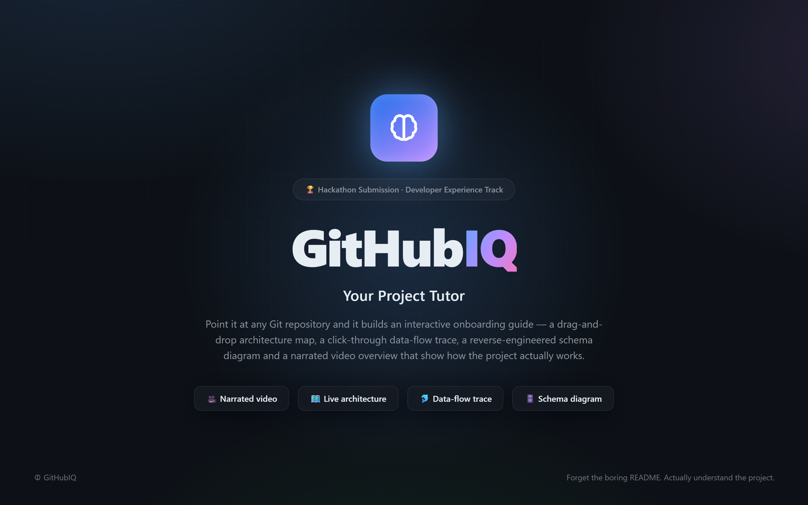
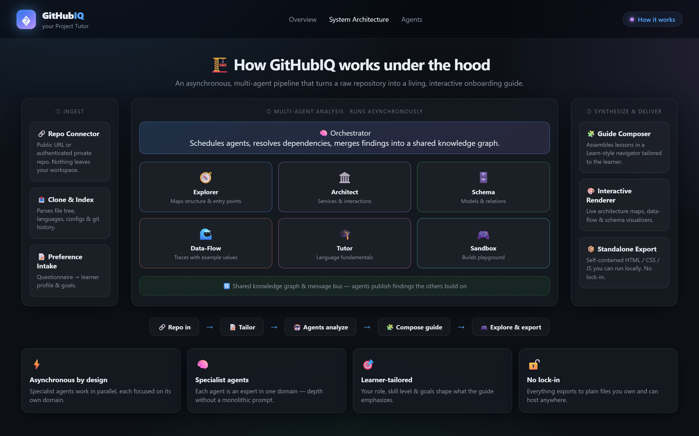
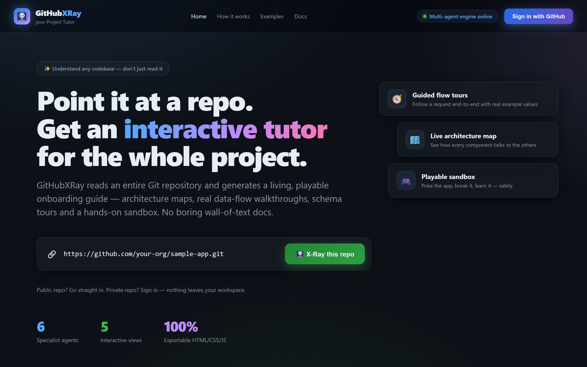
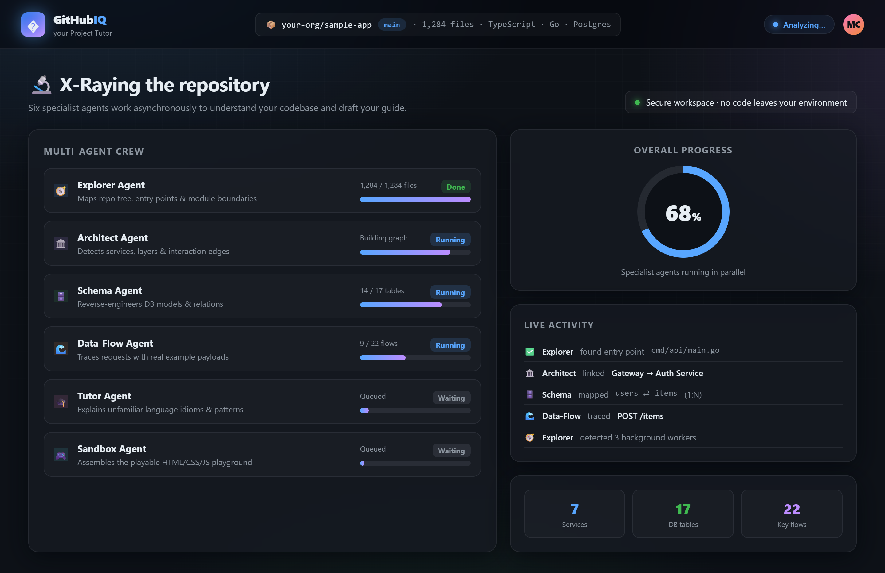
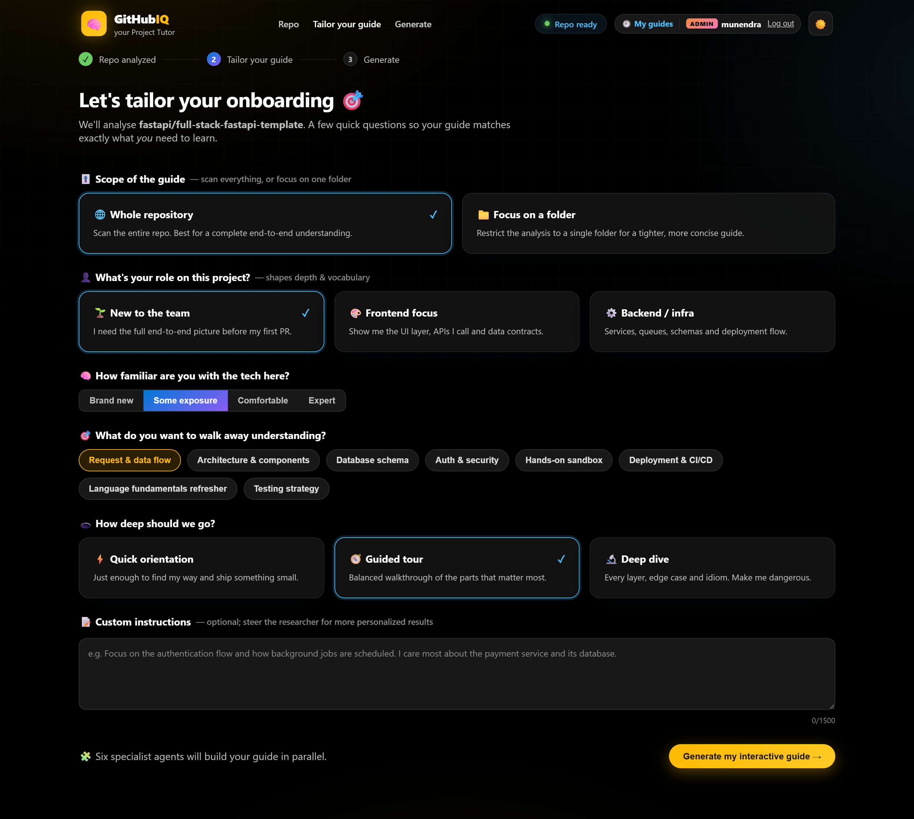
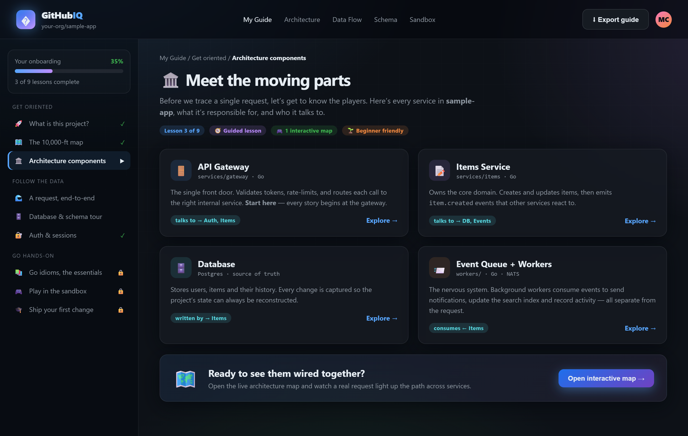
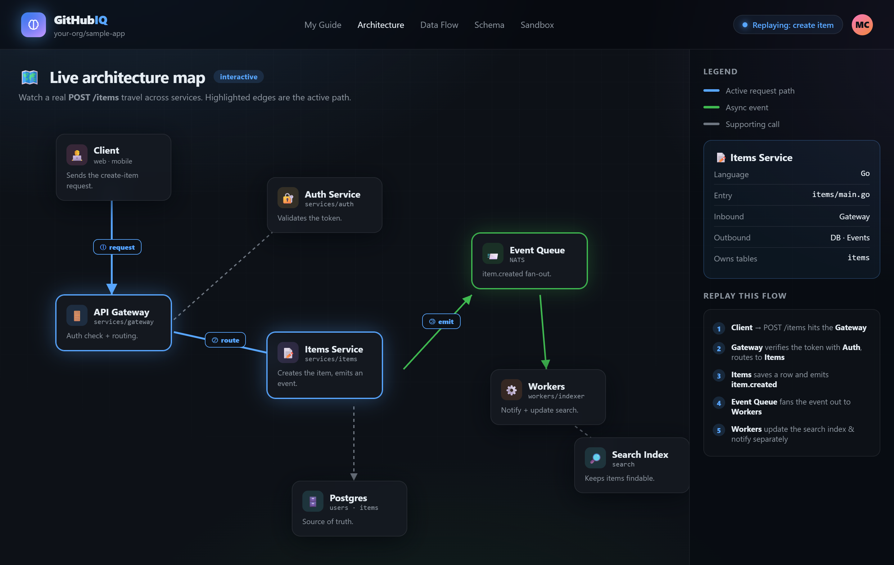
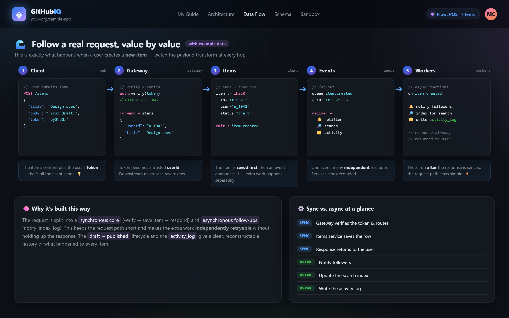
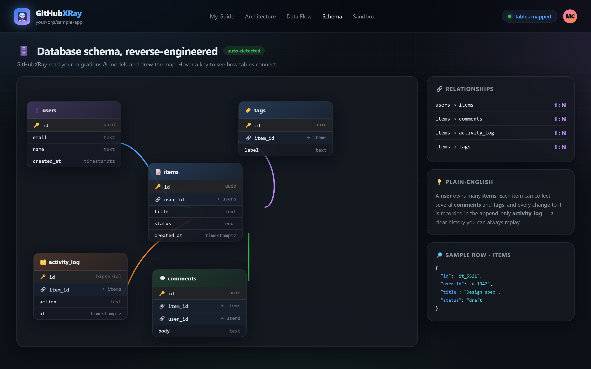
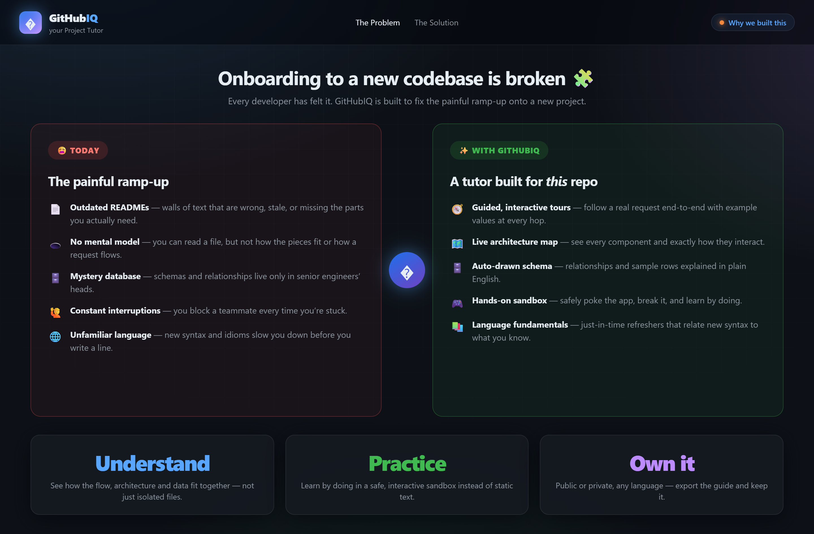

# GitHubIQ

GitHubIQ is an interactive project tutor that turns any Git repository into a living, explorable onboarding guide. A crew of specialist AI agents crawls the codebase and produces a component-wise guide, a drag-and-drop architecture map, a click-through data-flow trace, a reverse-engineered database schema, and a short **persona-narrated video overview**.



## Overview

Understanding an existing codebase usually means reading outdated docs, tracing requests across many files, and interrupting teammates. GitHubIQ makes that ramp-up fast and visual.

You sign in, paste a public repo URL (optionally scoping to a single folder), and answer a few questions about your role, experience and goals. Seven specialist agents analyse the repository in parallel and compose a guide tailored to you.

## Features

- **Component-wise guide** — starts with plain-language *what / what it does / how it works*, then breaks the project down component by component, with rich Markdown (headings, bullets, code).
- **Persona-narrated video** — a short auto-playing explainer where a presenter (Alex) walks you through the project with animated slides, captions and **Azure Speech** narration.
- **Drag-and-drop architecture map** — layered, interactive diagram; drag the components, click a node to see its tech and connections.
- **Click-through data flow** — walk a real request hop by hop and see the data transform, the code and the files at each step.
- **ER schema diagram** — the database reverse-engineered into a draggable diagram with foreign-key relationship lines (hidden when the repo has no database).
- **Folder scoping** — analyse the whole repo, or restrict to a single folder via a file explorer for a tighter guide.
- **Accounts, history & rate limiting** — sign in, revisit every guide you've generated, and a configurable per-user quota (default 1 analysis / 4 h; admins are unlimited).
- **Export to PDF** and a GitHub **dark/light** theme.

## How It Works

1. Sign in and connect a public Git repository (optionally scope to a folder).
2. Provide your role, experience level, goals and preferred depth.
3. Seven specialist agents crawl and analyse the repo in parallel.
4. An orchestrator composes the findings into a project-specific guide.
5. Explore the guide, watch the narrated video, and export it.

## Analysis Pipeline

GitHubIQ orchestrates seven specialist agents with **LangGraph**:

| Agent | Responsibility |
| --- | --- |
| Researcher | Crawls the repo like an engineer: maps structure, finds entry points, identifies components and assigns the exact files each specialist should read. |
| Architect | Maps components, layers and how they interact (with tech and inbound/outbound edges). |
| Schema | Reverse-engineers database tables, columns and relationships. |
| Data-Flow | Traces the main operation end to end with real data at each hop. |
| Deep-Dive | Writes an in-depth, code-grounded section for **every** component, so the guide scales with the repository. |
| Tutor | Explains the language and framework idioms specific to this repo. |
| Presenter | Scripts the persona-narrated video overview. |

The researcher's curated file assignments are the key to capturing deep context. A
**chunked map-reduce compaction** layer (backed by a low-cost model) guarantees
every assigned file contributes — large files are summarised chunk by chunk rather
than dropped — and the output **scales with repo size**: bigger repositories yield
more components, architecture nodes, data-flow steps and per-component deep dives.
Findings are merged by an orchestrator before the guide is generated.



## MVP Implementation

A working MVP that analyses **public** GitHub repositories end to end.

- **Backend** — Python / FastAPI with a **LangGraph** multi-agent pipeline
  (Researcher → Architect ∥ Schema ∥ Tutor → Data-Flow → Deep-Dive → Presenter → compose)
  using real fan-out/fan-in orchestration.
- **Frontend** — React + Vite + TypeScript with a GitHub **dark/light** theme:
  component-wise guide (Markdown), narrated video player, drag-and-drop
  architecture map, click-through data flow, draggable ER schema, folder-scope
  picker, history and PDF export.
- **AI** — Azure OpenAI **gpt-4.1** and Azure **Speech** text-to-speech, both
  hosted in one Azure AI Foundry (AI Services) account. Agents degrade to
  heuristics when no LLM is configured, so the app always runs.
- **Auth** — signup/login with signed tokens, an admin bypass and a configurable
  per-user rate limit. Passwords are hashed (PBKDF2); the admin password is
  stored only as a hash, never in source.
- **Database** — Azure Cosmos DB (serverless) for guides and users; an in-memory
  store is used automatically for local dev.
- **Containers** — a `Dockerfile` per service plus `docker-compose.yml`.
- **Cloud & CI/CD** — `infra/main.bicep` + `azure.yaml` for Azure Container Apps,
  and GitHub Actions workflows (`.github/workflows/`) that build images in ACR
  and deploy via OIDC (no secrets in the repo).

### Project layout

```
backend/    FastAPI app + LangGraph agents (app/agents/*)
frontend/   Vite + React + TS single-page app
infra/      main.bicep (Container Apps, Azure OpenAI, Cosmos)
azure.yaml  azd service definitions
docker-compose.yml
```

### Run locally with Docker

```bash
cp .env.example .env       # optional: add Azure OpenAI + Cosmos creds
docker compose up --build
# frontend → http://localhost:8080 , backend → http://localhost:8000/docs
```

Without credentials the backend runs in heuristic mode (no LLM, in-memory store).
Add `AZURE_OPENAI_*` and `COSMOS_*` to `.env` for full LLM-powered, persisted output.

### Run locally without Docker

```bash
# Backend (Python 3.12)
cd backend
python -m venv .venv && .venv/Scripts/activate   # or source .venv/bin/activate
pip install -r requirements.txt
uvicorn app.main:app --reload

# Frontend
cd frontend
npm install
npm run dev        # http://localhost:5173 (proxies /api → :8000)
```

### Deploy to Azure

```bash
azd up             # provisions Container Apps + Azure OpenAI + Cosmos and deploys
```

Or provision with Bicep directly:

```bash
az group create -n rg-githubiq -l eastus2
az deployment group create -g rg-githubiq -f infra/main.bicep
```

## Screenshots


### Repository Connection



### Repository Analysis



### Learning Preferences



### Interactive Guide



### Architecture Map



### Data-Flow Walkthrough



### Database Schema



### Problem and Solution

